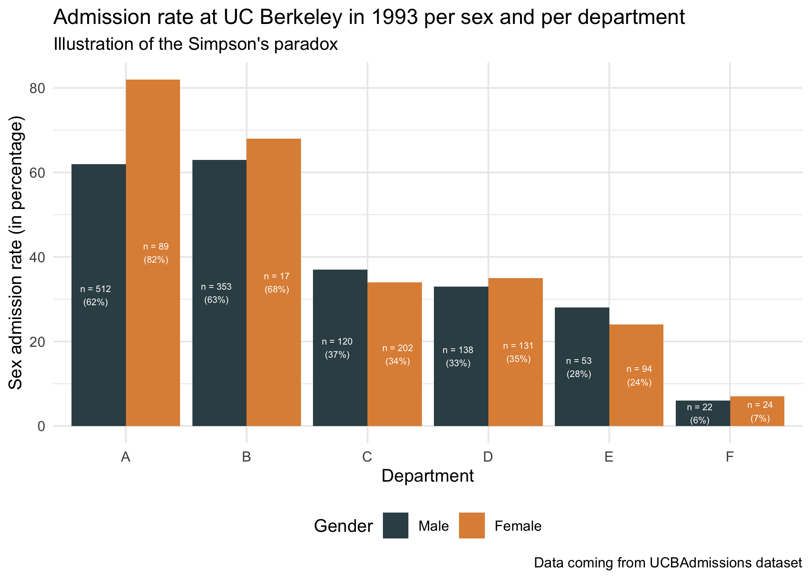

```{r setup, include=FALSE}
knitr::opts_chunk$set(
  echo  = TRUE,
  rows.print = 5)
```

## Preliminaries

### Package requirements

We start by loading a couple of packages for data manipulation and representation. Please install them using install.packages("name_of_the_pacakge") if not already done.

```{r packages, message = FALSE, warning = FALSE}
library(tidyverse)    # advanced data manipulation and vizualisation
library(knitr)        # R notebook export and formatting 
library(ggsci)        # Fancy color palettes inspired by scientific journals
library(cowplot)      # To combine several plots on the same canvas
```

## Exercise 1 {.tabset}

### Import data

This exercise relies on the native R dataset "UCBAdmissions" which stores **student admissions at UC Berkeley** for the six largest departments in 1973 in function of the student gender. Please note that the data is originally stored as a 3-dimensional array, which we convert into a data frame for the rest of the exercise.

```{r import_data_students_berkeley}
#TO RUN 
UCBAdmissions #3-dim array
UCBAdmissions <- as.data.frame(UCBAdmissions) #Convert into a data frame
head(UCBAdmissions)
```

**Question 1** : Have a closer look at the dataset : how many rows? How many variables? How many observations (*i.e.* number of applications)? How many different college departments are there? Briefly describe the variables.

```{r question1_ex1_correction}
UCBAdmissions %>% nrow() #24 rows
UCBAdmissions %>% ncol() #4 variables
UCBAdmissions %>% select(Dept) %>% unique() %>% nrow() #Number of departments
sum(UCBAdmissions$Freq) #Total number of observations
```

**Correction**: 
The dataset comprises 24 rows and 4 variables : Admit (Admitted or Rejected), Gender (Male or Female), Dept (the university department) and Freq (the number of students).
In total 4526 observations are stored (which is the sum of the column Freq). 
There are 6 different departments whose names go from A to F.
 
### Data description 

**Question 2** : Using what you have learned about tidy data and the dplyr package, compute the  total **number** of admissions and rejections per Gender as well as the admission rate (number of admissions divided by number of aplications) per Gender. 

Do you see a difference of admission rates per Gender at Berkeley? 

```{r question2_ex1_correction, warning = FALSE, message =FALSE}
UCBAdmissions %>%
  group_by(Gender, Admit) %>%
  summarise(count = sum(Freq)) %>%
  group_by(Gender) %>%
  mutate(rate_per_gender = count / sum(count))
```

**Correction** : It seem that there is a huge difference between male admissions (about 45% percent of applications) and female admissions (only 30% of applications). 


**Question 3** : Compute now the number of :

1. Applications by departement 
2. Admission/rejection rates per department (without distinction on the gender). 

Are there departments with more applications than others? Do the admission rates differ according to the department?  

```{r question3_correction, warning = FALSE, message =FALSE}
UCBAdmissions %>%
  group_by(Dept, Admit) %>%
  summarise(count = sum(Freq)) %>%
  group_by(Dept) %>%
  mutate(total_number_applications = sum(count)) %>%
  mutate(rate_per_dpt = count / total_number_applications) %>%
  filter(Admit == "Admitted") #No need to keep the rows for rejection since they do not add more information. 
```

**Correction** The number of applications per departement does not vary much : it goes from 584 (department E) to 933 (department A). There is yet a huge difference in admission rates according to the departments, since it goes from about 6% (department F) to 64% (department A). 

**Question 4** : Compute finally the rates of male/female applications per department (without taking into account the admission results).

Can you draw an hypothesis to explain the difference of rate admissions between male and female (question 2)? 

```{r question4_correction, warning = FALSE, message =FALSE}
UCBAdmissions %>%
  group_by(Dept, Gender) %>%
  summarise(count = sum(Freq)) %>%
  group_by(Dept) %>%
  mutate(total_number_applications = sum(count)) %>%
  mutate(gender_rate_per_dpt = count / sum(count))
```

**Correction**
There is a huge difference in application rates per department according to the Gender :  males tend to apply more to departments A (88%) and B (95%) , women tend to apply more to departments C (64%) and E (67%). There is about a 50% gender rate application for departments D and F. 
When crossing these results with the results from the previous question, it seems that women tend to apply more to departments with lower application rates (30 and 25% respectively for department C and E). This may explain the huge difference in admission rates between men and women. 

### Fancy data representation

The paradox you have illustrated in the previous part is called the *Simpson's paradox*.
[You can read more about it here.](https://en.wikipedia.org/wiki/Simpson%27s_paradox)

The goal of this section is to illustrate this paradox by plotting the sex admission rate (in percentage) per department. 

**Question 5** Please observe the plot thereafter and reproduce it using ggplot2.

```{r question5_plot_to_reproduce}

```

*Hints* : 

1) The color palette is "JAMA", which comes from the package 'ggsci' loaded at the beginning of the homework. You can use the function "scale_color_jama()" or "scale_fill_jama()".

2) You can use the function *round* to round the percentage of admission per sex. 

3) You can use the function *paste0* to concatenate in a single string the number of applications (Freq) and the sex admission rate in percentage. The special character '\\n' is used for line break. 

4) To use geom bar with pre-computed Frequencies (and thus with an "x" and a "y" aesthetics) you should use *stat = "identity"*. 

5) To ask geom_text to use a dodge position, you can set the argument "position" to the value  *position_dodge(width =1)*. 

6) The argument "size" from the function geom_text enables to change the font size. 

```{r question5_correction, warning = FALSE, message =FALSE}
#Step 1 : compute the pourcentage of admission rate per gender and per  departments
UCBAdmissions_sexrate <- UCBAdmissions %>%
  group_by(Dept, Gender) %>%
  mutate(percent_admission_sex = round(100* Freq / sum(Freq))) %>%
  filter(Admit == "Admitted") %>%
  mutate(label = paste0("n = ", Freq, "\n(", percent_admission_sex,"%)"))

head(UCBAdmissions_sexrate)

#Step 2 : plot
ggplot(data = UCBAdmissions_sexrate, aes(x = Dept, y = percent_admission_sex, fill = Gender)) + 
  geom_bar(stat = "identity",position = "dodge") +
  scale_fill_jama() +
  geom_text(aes(label  = label, y = percent_admission_sex/2), position = position_dodge(width=1), color = "white", size = 2) + 
  theme_minimal() +
  xlab("Department") +
  ylab("Sex admission rate (in percentage)") +
  theme(legend.position = "bottom") +
  labs(title = "Admission rate at UC Berkeley in 1993 per sex and per department", subtitle = "Illustration of the Simpson's paradox", caption = "Data coming from UCBAdmissions dataset") #+
  #ggsave("resources/sex_admission_rate.png")
```


## Exercise 2 {.tabset}

### Import data

Exercise 2 relies on the dataset "relig_income" coming from the tidyverse package. The dataset store the results of a religion vs income survey : number of survey respondents in each category religion/income. The incomes are cut into 10k dollar ranges. Note that there are special categories for "missing" data : "Don't know/ refused".

```{r show_data}
relig_income
```

The goal of this exercise is to plot the distribution of religious beliefs faceted by income ranges. You see that the way the data is presented (with the income ranges in different columns) prevents us from directly using "facet_wrap" or "group_by" function. One commonly says that the dataset is in a "wide" format. 
We will present two methods to override this issue :

1. Draw separately one plot per income range and gather all the plots using the package cowplot. Though being a good introduction to cowplot, we will see why this method proves to be very inefficient here.

2. Transform the dataset from a wide format to a **long format** with tidyverse tools in order to use "facet_wrap". This method is much more recommended. 

### Method 1

**Question 1** 

Let's focus for this question on a given income range (let's say less than 10k dollars). Note that you surround the colnames by "`" since they contain sepcial character (which is something you should definitely avoid when creating datasets).

1. Compute the rounded percentage of religious affiliations for this income range. Arrange the dataset per decreasing percentage and keep only the 5th top rows (you can use the function head)

2. Plot the distibution of the top 5 religious affiliations as a bar plot. Make sure to rename the y axis label properly as well as to choose a color palette for religion. Use geom_text to write the percentage of each religion for this income range on top of the bars (you can use vjust = 0 to align the text to the top). Remove the x axis text and x axis title since it is redondant with the legend and position the legend at the bottom of the plot. Once done, rename your ggplot object as relig_income_less_10k.

```{r question1_ex2_correction}
#Step 1 
relig_income_one_range <- relig_income %>% 
  select(religion, `<$10k`) %>%
  mutate(percent = round(100 *`<$10k` / sum(`<$10k`))) %>%
  arrange(desc(percent)) %>%
  head(5)

#Step 2
relig_income_less_10k = ggplot(data = relig_income_one_range, aes(x = religion, y = `<$10k`, fill = religion)) +
  geom_text(aes(label= paste0(percent,"%")), color = "black", vjust = 0) + 
  geom_bar(stat = "identity") +
  scale_fill_npg(name = "Religion") + 
  xlab("") +
  ylab("Count") + 
  ggtitle("Distibution of the religous beliefs for <$10k incomes")+ 
  theme(legend.position = "bottom", 
        axis.text.x = element_blank())
relig_income_less_10k
```

**Question 2** 

Reproduce the code above for data income range "more than 150k dollars". Call your plot relig_income_more_150k. What issue can you see with the color palette? 

```{r question2_ex2_correction}
#Step 1 
relig_income_one_range <- relig_income %>% 
  select(religion, `>150k`) %>%
  mutate(percent = round(100 *`>150k` / sum(`>150k`))) %>%
  arrange(desc(percent)) %>%
  head(5)

#Step 2
relig_income_more_150k = ggplot(data = relig_income_one_range, aes(x = religion, y = `>150k`, fill = religion)) +
  geom_text(aes(label= paste0(percent,"%")), color = "black", vjust = 0) + 
  geom_bar(stat = "identity") +
  scale_fill_npg(name = "Religion") + 
  xlab("") +
  ylab("Count") + 
  ggtitle("Distibution of the religous beliefs for >*150k incomes")+ 
  theme(legend.position = "bottom", 
        axis.text.x = element_blank())
relig_income_more_150k
```

**Correction** 
The top five religions differ among the two plots. Since the two plots were generated independently with the same color palette, the color affiliation changes : there is no common legend.
 
**Question 3** 

Use the function plot_grid from the cowplot package to gather the two plots into one figure (on the same row). Are you satsified with the results? 

```{r question3_ex2_correction}
#?plot_grid
plot_grid(relig_income_less_10k,
          relig_income_more_150k,
          nrow = 1 )
```

**Correction : ** Plot_grid function is very useful to gather plots (easy to use, automatic alginements). Yet, the plots to gather must be drawn independently. As a result, there is no common legend in the final plot. Though being vey useful to gather plots coming from different sources into one figure, cowplot is less efficient that facet_wrap to stratify studies according to one variable (the income range in this case). 

You have seen how to gather two plots into a single one using plot_grid. Acutually, plot_grid can take as argument a list of plots, meaning that we could have used it to draw bar plots for each level of incomes  (using a for loop or a function such as lapply to generate the list of plots).

In next section, we will foccus on another method, much more useful in practice, to plot hte distribution of top 5 religious beliefs per income range. 

### Method 2

The relig_income dataset is stored into a wide format. In this section, we are going to convert it into a "long" format meaning that we are going to create a new variable storing income ranges. The dataset in a long format will have only 3 columns (religion, income and count) but more rows than the original dataset in wide format : one row per couple religion/income range. 

**Question 4** 

Transform relig_income into relig_income_long using the function pivot_longer function from the tidyverse package. 

```{r question4_ex2_correction}
?pivot_longer

relig_income_long <- relig_income %>%
  pivot_longer(!religion,
               names_to = "income", 
               values_to = "count")

nrow(relig_income_long) #18 religions * 10 income ranges = 180 
```

**Question 5** 

Compute the rounded percentage of people belonging to each religion per income range. Keep only the 5 top religions per income range (you can use group_by and slice_max function). 

```{r question5_ex2_correction}
relig_income_long_top5 <- relig_income_long %>%
  group_by(income) %>%
  dplyr::mutate(percent = round(100*count/sum(count))) %>%
  slice_max(order_by = count, n = 5)
relig_income_long_top5
```

**Question 6**

Plot the distribution of top 5 religions **facetted by** income ranges (using facet_wrap). Make sure to rename the y axis label properly as well as to choose a color palette for religion. Use geom_text to write the percentage of each religion for this income range on top of the bars (you can use vjust = 0 to align the text to the top). Remove the x axis text and title since it is redondant with the legend and position the legend at the bottom of the plot. 

```{r question6_ex2_correction}
ggplot(data = relig_income_long_top5, aes(x = religion, y = percent, fill = religion)) +
  geom_text(aes(label= paste0(percent,"%")), color = "black", vjust = 0) + 
  geom_bar(stat = "identity") +
  scale_fill_npg(name = "Religion") + 
  xlab("") +
  ylab("Count") + 
  facet_wrap( .~ income) + 
  ggtitle("Distribution of the religious beliefs")+ 
  theme(legend.position = "bottom", 
        axis.text.x = element_blank())
```

You should see that facet_wrap creates a common legend (a religion has the same color in all the plots) and leaves blanks when a religion does stand in the top 5 religion for a given income range.

**Question 7**

We still have an issue concerning the order of the facet wrap plots which seems to follow the alphabetical order, while we would have liked it to be arranged from lower to higher incomes.

One way to cope with this is to set the levels of the variable income (seen as a factor variable) either by hand or by using regular expressions. In this case, we can use the order defined by the columns of the wide relig_income dataset, which were already in the good order.
Re-do the plot after arranging the levels of the variable income. 

```{r question7_ex2_correction}
relig_income_long_top5$income <- factor(relig_income_long_top5$income, levels = setdiff(colnames(relig_income),"religion"))

ggplot(data = relig_income_long_top5, aes(x = religion, y = percent, fill = religion)) +
  geom_text(aes(label= paste0(percent,"%")), color = "black", vjust = 0) + 
  geom_bar(stat = "identity") +
  scale_fill_npg(name = "Religion") + 
  xlab("") +
  ylab("Count") + 
  facet_wrap( .~ income) + 
  ggtitle("Distribution of the religious beliefs")+ 
  theme(legend.position = "bottom", 
        axis.text.x = element_blank())
```
